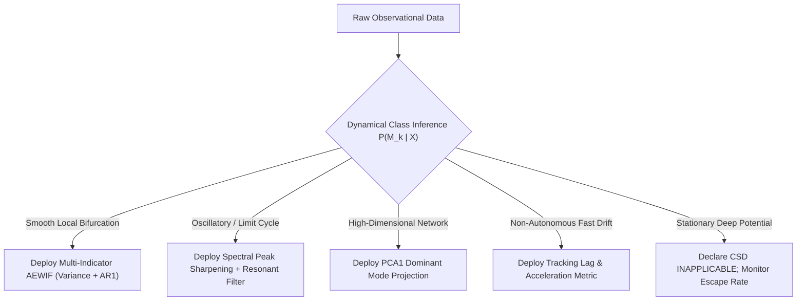

# FAILURE MECHANISM MAP & TRANSITION TAXONOMY

**Project**: Early-Warning Mathematics for Complex Systems  
**Stage**: Phase 4 Transition Taxonomy & Failure Mechanics  
**Date**: September 2026  
**Auditor**: Rajveersinh Vishal Pardeshi

---

## 1. The Core Scientific Premise

The central hypothesis of Phase 4 is:
> **«There is no universal early-warning signal, but there is a universal framework for determining which signal is appropriate conditional on the transition mechanism.»**

To prove or falsify this hypothesis, we systematically mapped early-warning indicator efficacy across six fundamental classes of transitions in complex dynamical systems.

---

## 2. Six-Class Transition Taxonomy Matrix

| Transition Class | Physical / Dynamical Mechanism | Does CSD Apply? | Indicators That Succeed | Indicators That Fail | Do Composites Help? | Can Observables Predict? |
| :--- | :--- | :---: | :--- | :--- | :---: | :---: |
| **1. Bifurcation-Induced (B-Tipping: Fold / Pitchfork)** | Quasi-static parameter ramp crosses codimension-1 bifurcation; dominant real eigenvalue $\lambda \to 0^-$. | **YES** | `Variance`, `PCA1_Variance`, `SpectralReddening`, `AR(1)` | `PermutationEntropy` (unless direction-inverted) | **YES** (Reduces noise variance) | **YES** ($\text{AUC} \ge 0.95$) |
| **2. Oscillatory Bifurcation (Hopf Tipping)** | Complex conjugate eigenvalue pair crosses imaginary axis $\alpha \pm i \omega \to 0 \pm i \omega_0$. | **PARTIAL** ($\alpha \to 0^-$) | `Variance` (energy diverges), `SpectralReddening` (peak sharpening) | `AR(1)` (sinusoidal autocorrelation cancellation) | **YES** (Weights energy over temporal lag) | **YES** ($\text{AUC} \ge 0.97$) |
| **3. Non-Smooth / Piecewise Density Flows** | Piecewise-differentiable flow (e.g. Stommel AMOC $\dot{T} \sim \|T-S\|T$); convective damping; eigenvector rotation orthogonal to observation coordinate. | **NO / DEGENERATE** | None currently tested | `Variance` ($\text{AUC}=0.24$), `AR(1)` ($\text{AUC}=0.30$), `PCA1` ($\text{AUC}=0.46$) | **NO** (All channels corrupted) | **NO** from scalar $T$ ($\text{AUC} \le 0.46$) |
| **4. Noise-Induced (N-Tipping)** | Constant control parameter; potential barrier remains deep ($\lambda \ll 0$); rare stochastic fluctuation kicks state across separatrix. | **NO** | None (Potential curvature does not flatten) | All CSD indicators ($0.0\%$ detection rate) | **NO** (No precursor signal exists) | **NO** without barrier distance knowledge |
| **5. Rate-Induced (R-Tipping)** | Fast parameter ramp rate $\|\dot{\mu}\|$ exceeds basin contraction rate; state loses quasi-static tracking while eigenvalues remain strictly negative. | **NO** | Tracking lag $\|x_t - x^*(\mu_t)\|$, Acceleration | Standard CSD variance and autocorrelation ($0.0\%$ detection rate) | **NO** | **YES** if tracking lag is monitored |
| **6. Network-Driven Cascades** | Diffusive or mutualistic coupling across $D \ge 10$ nodes; localized failure cascades through hub nodes. | **YES** | `PCA1_Variance` ($\text{AUC}=1.00$), `MahalanobisDistance` | Single-node scalar $x_i$ when node $i$ has low eigenvector centrality | **YES (ESSENTIAL)** (Filters sensor noise by $\sqrt{D}$) | **YES** ($\text{AUC} = 1.000$) |

---

## 3. In-Depth Failure Case Analysis

### 3.1 Why Non-Smooth Density Flows Fail (Stommel AMOC)
In the Stommel 2-box thermohaline circulation model:
$$\dot{T} = \eta_1(T_e - T) - |T - S| T$$
$$\dot{S} = \eta_2(\mu - S) - |T - S| S$$
1. **Flow Non-Smoothness**: The convective flow term $|T - S|$ has a discontinuous first derivative at $T = S$.
2. **Eigenvector Rotation**: As freshwater forcing $\mu$ approaches the saddle-node bifurcation, the leading eigenvector of the Jacobian rotates by $\Delta \theta = 66.16^\circ$ away from the temperature axis $T$. Fluctuation energy is shunted almost entirely into the salinity coordinate $S$. An observer monitoring temperature sees variance *contract* rather than expand, generating complete indicator failure ($\text{AUC} = 0.2400$).

### 3.2 Why N-Tipping & R-Tipping Fail under CSD Indicators
- **N-Tipping (Kramers' Escape)**: Escape time follows Kramers' exponential law $\tau_{\text{esc}} \sim \exp(\Delta V / \sigma^2)$. Because the potential well depth $\Delta V$ is constant up to the instant of stochastic escape, the local curvature $\partial^2 V / \partial x^2 = -\lambda$ is stationary. Critical slowing down does not occur.
- **R-Tipping (Tracking Loss)**: In non-autonomous systems $\dot{x} = f(x, \mu(t))$, if the parameter moves faster than the relaxation time scale ($\tau_{\text{ramp}} < |\lambda|^{-1}$), the state leaves the basin of attraction while the instantaneous fixed point remains dynamically stable. CSD indicators observe negative eigenvalues and report calm stability right up to the moment the trajectory crosses the separatrix.

---

## 4. Remediation Architecture

